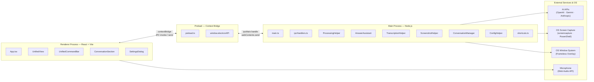
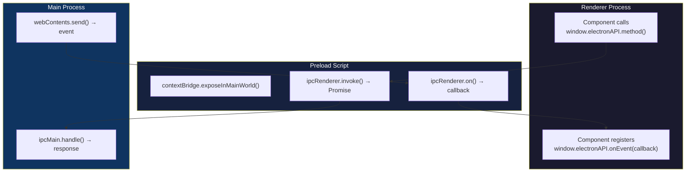
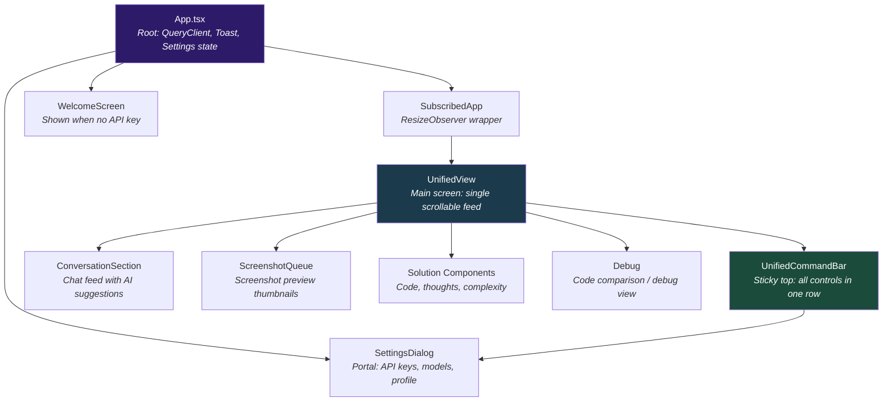
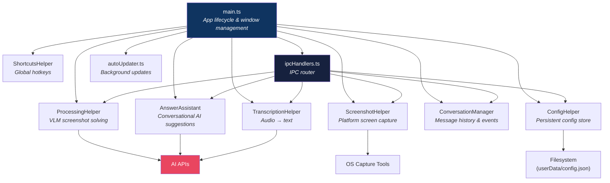
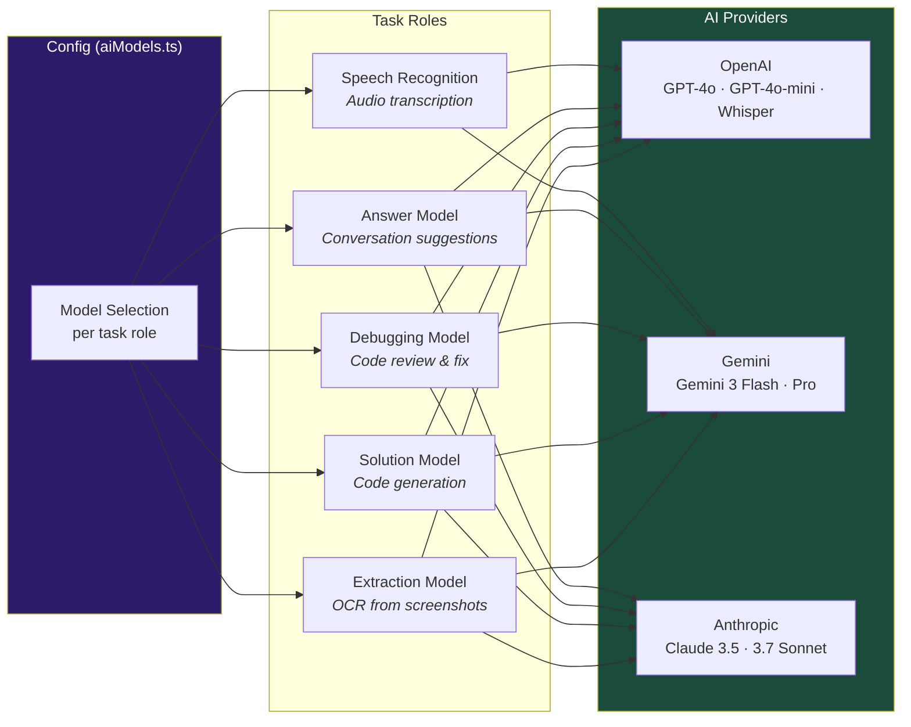
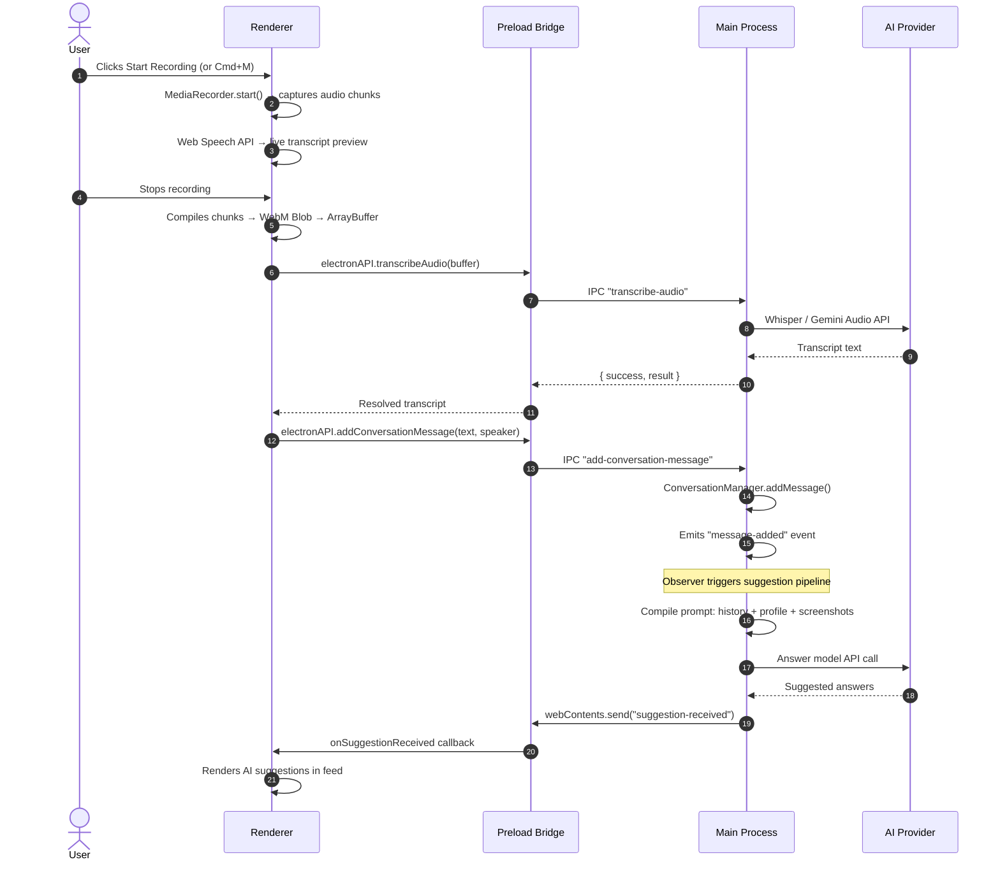
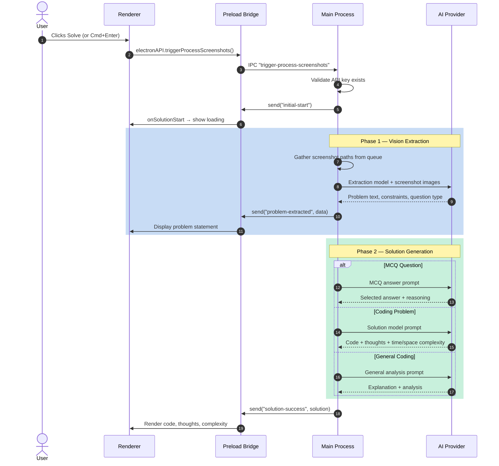
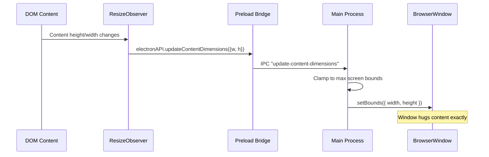
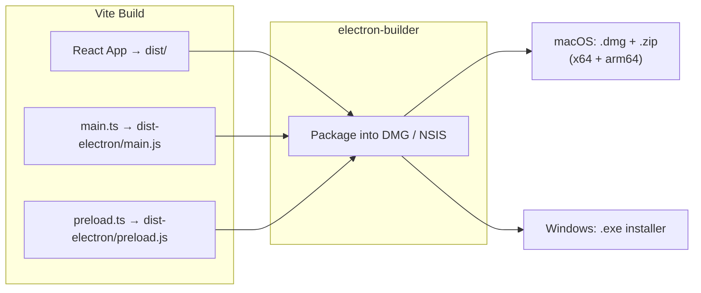

# Project Architecture & Structure

> **Interview Coder** — An Electron-based invisible overlay desktop app that provides real-time AI-powered interview assistance through screen capture analysis, live audio transcription, and multi-provider LLM integration.

---

## 1. High-Level Architecture

The application runs as a **frameless, transparent, always-on-top Electron overlay** with three isolated runtime layers communicating over IPC:



### Runtime Layers

| Layer | Technology | Role |
|:------|:-----------|:-----|
| **Renderer** | React 18, TypeScript, Tailwind CSS, TanStack Query | UI rendering, audio capture via `MediaRecorder`, live speech recognition via Web Speech API |
| **Preload** | Electron `contextBridge` | Secure IPC bridge — exposes `window.electronAPI` with typed methods and event listeners |
| **Main** | Node.js, Electron APIs | Window management, global hotkeys, screen capture, AI API orchestration, config persistence |

---

## 2. Process Communication

All cross-process communication flows through the preload bridge. The Renderer never has direct access to Node.js APIs.



### Key IPC Channels

| Channel | Direction | Purpose |
|:--------|:----------|:--------|
| `transcribe-audio` | Renderer → Main | Send audio buffer for Whisper/Gemini transcription |
| `trigger-process-screenshots` | Renderer → Main | Trigger VLM screenshot analysis pipeline |
| `trigger-screenshot` | Renderer → Main | Capture a new screenshot |
| `get-config` / `update-config` | Renderer → Main | Read/write app configuration |
| `add-conversation-message` | Renderer → Main | Add a transcribed message to conversation history |
| `update-content-dimensions` | Renderer → Main | Resize overlay window to hug content |
| `screenshot-taken` | Main → Renderer | Notify UI of new screenshot with preview |
| `solution-success` | Main → Renderer | Deliver solution code, thoughts, and complexity |
| `problem-extracted` | Main → Renderer | Deliver extracted problem statement from screenshots |
| `suggestion-received` | Main → Renderer | Deliver AI answer suggestions for conversation |
| `reset-view` | Main → Renderer | Reset the UI to initial state |

---

## 3. Component Architecture

### Renderer Component Tree



### Key UI Components

| Component | File | Responsibility |
|:----------|:-----|:---------------|
| **App** | `src/App.tsx` | Root. Provides QueryClient, Toast context, checks API key, lazy-loads SettingsDialog |
| **SubscribedApp** | `src/_pages/SubscribedApp.tsx` | Wraps UnifiedView with ResizeObserver that sends dimensions to main via IPC |
| **UnifiedView** | `src/_pages/UnifiedView.tsx` | Single scrollable feed combining conversation, screenshots, and solutions. Manages all solution/debug state |
| **UnifiedCommandBar** | `src/components/UnifiedCommandBar.tsx` | Sticky command bar: recording, speaker toggle, mute, screenshot, solve/debug, language, settings gear |
| **ConversationSection** | `src/components/Conversation/ConversationSection.tsx` | Displays conversation messages, live transcript, and AI suggestions |
| **SettingsDialog** | `src/components/Settings/SettingsDialog.tsx` | Full-screen portal dialog for API provider, key, model selection, candidate profile |
| **Debug** | `src/_pages/Debug.tsx` | Code comparison view during debug sessions |
| **useConversation** | `src/hooks/useConversation.ts` | Custom hook: MediaRecorder, Web Speech Recognition, transcription dispatch, suggestion handling |

---

## 4. Main Process Helpers

Each helper follows the **Single Responsibility Principle** and communicates through dependency injection interfaces.



| Helper | File | Responsibility |
|:-------|:-----|:---------------|
| **main.ts** | `electron/main.ts` | App lifecycle, BrowserWindow creation (frameless, transparent, always-on-top, content-protected), window positioning/resizing, visibility toggle |
| **ipcHandlers.ts** | `electron/ipcHandlers.ts` | Routes all `ipcMain.handle()` calls to the appropriate helper. Central IPC dispatch layer |
| **ProcessingHelper** | `electron/ProcessingHelper.ts` | Core VLM pipeline: extracts text from screenshots via vision models, classifies question type (MCQ / coding / general), generates solutions with code and complexity analysis |
| **AnswerAssistant** | `electron/AnswerAssistant.ts` | Compiles conversation context (history + candidate profile + screenshots) into prompts and generates real-time answer suggestions |
| **TranscriptionHelper** | `electron/TranscriptionHelper.ts` | Receives WebM audio buffers, writes to temp files, sends to Whisper (OpenAI) or Gemini Audio for transcription |
| **ScreenshotHelper** | `electron/ScreenshotHelper.ts` | Platform-aware capture: `screencapture` CLI on macOS, PowerShell on Windows. Manages screenshot queue (max 5), base64 previews |
| **ConversationManager** | `electron/ConversationManager.ts` | EventEmitter-based message store. Tracks interviewer/interviewee messages, emits `message-added` events that trigger the suggestion pipeline |
| **ConfigHelper** | `electron/ConfigHelper.ts` | Persists config to `userData/config.json`. Manages API keys, provider selection, model choices, language, opacity, candidate profile |
| **ShortcutsHelper** | `electron/shortcuts.ts` | Registers OS-level global shortcuts via `globalShortcut` |
| **autoUpdater** | `electron/autoUpdater.ts` | Background update checks via `electron-updater` |
| **store.ts** | `electron/store.ts` | Creates the config store backplane |

---

## 5. AI Provider Architecture

The app supports three AI providers with per-task model selection:



Model definitions and defaults live in [`shared/aiModels.ts`](file:///Users/adityajandu/Coding/Latest/interview-coder-withoupaywall-opensource/shared/aiModels.ts) — the single source of truth shared by both processes.

---

## 6. End-to-End Flows

### A. Live Conversation & AI Suggestion Pipeline



### B. Screenshot Solve Pipeline (Answer Now)



### C. Window Dimension Sync (Dynamic Hugging)



---

## 7. Directory Structure

```
interview-coder/
├── electron/                        # Main Process (Node.js runtime)
│   ├── main.ts                      # App lifecycle, window management, overlay config
│   ├── preload.ts                   # Context bridge — exposes window.electronAPI
│   ├── ipcHandlers.ts               # Central IPC router (all ipcMain.handle registrations)
│   ├── shortcuts.ts                 # Global hotkey bindings (ShortcutsHelper class)
│   ├── ProcessingHelper.ts          # VLM pipeline: OCR extraction → solution generation
│   ├── AnswerAssistant.ts           # Conversational AI suggestion compiler
│   ├── TranscriptionHelper.ts       # Audio → text via Whisper / Gemini
│   ├── ScreenshotHelper.ts          # Platform screen capture & queue management
│   ├── ConversationManager.ts       # Message history store (EventEmitter)
│   ├── ConfigHelper.ts              # Config persistence & API key validation
│   ├── autoUpdater.ts               # electron-updater integration
│   ├── store.ts                     # Config store backplane
│   └── tsconfig.json                # Electron-specific TS config
│
├── shared/                          # Shared between Main & Renderer
│   ├── aiModels.ts                  # Provider definitions, model lists, defaults
│   └── textUtils.ts                 # Text normalization utilities
│
├── src/                             # Renderer Process (React app)
│   ├── main.tsx                     # React DOM mount point
│   ├── App.tsx                      # Root: providers, API key check, settings state
│   ├── index.css                    # Base Tailwind styles
│   ├── env.d.ts                     # window.electronAPI type declarations
│   │
│   ├── _pages/                      # Top-level views
│   │   ├── UnifiedView.tsx          # Main feed: conversation + screenshots + solutions
│   │   ├── SubscribedApp.tsx        # ResizeObserver wrapper for UnifiedView
│   │   ├── Debug.tsx                # Code comparison / debug review screen
│   │   └── SubscribePage.tsx        # Subscription page (bypassed locally)
│   │
│   ├── components/
│   │   ├── UnifiedCommandBar.tsx    # All-in-one command bar (recording, screenshots, settings)
│   │   ├── Conversation/
│   │   │   ├── ConversationSection.tsx  # Chat message feed & AI suggestion display
│   │   │   └── ConversationCommands.tsx # Legacy conversation controls
│   │   ├── Queue/
│   │   │   ├── ScreenshotQueue.tsx  # Screenshot list container
│   │   │   └── ScreenshotItem.tsx   # Individual screenshot thumbnail
│   │   ├── Settings/
│   │   │   ├── SettingsDialog.tsx   # Full-screen settings portal
│   │   │   └── CandidateProfileSection.tsx  # Resume & job description inputs
│   │   ├── Solutions/               # (Empty — solution rendering moved to shared)
│   │   ├── Header/
│   │   │   └── Header.tsx           # Legacy header bar with language selector
│   │   ├── shared/
│   │   │   ├── SolutionComponents.tsx  # ContentSection, SolutionSection, ComplexitySection
│   │   │   ├── LanguageSelector.tsx    # Programming language dropdown
│   │   │   └── LoadingText.tsx         # Animated loading text
│   │   ├── ui/                      # Radix-based primitives
│   │   │   ├── button.tsx
│   │   │   ├── card.tsx
│   │   │   ├── dialog.tsx
│   │   │   ├── input.tsx
│   │   │   └── toast.tsx
│   │   ├── MarkdownRenderer.tsx     # Markdown-to-React renderer
│   │   ├── UpdateNotification.tsx   # Auto-update notification banner
│   │   └── WelcomeScreen.tsx        # First-run screen (no API key)
│   │
│   ├── hooks/
│   │   └── useConversation.ts       # Recording, transcription, and suggestion hook
│   ├── contexts/
│   │   └── toast.tsx                # Toast notification context
│   ├── lib/
│   │   ├── supabase.ts              # Supabase client setup
│   │   └── utils.ts                 # Tailwind class merge utility
│   ├── types/
│   │   ├── electron.d.ts            # Detailed electronAPI interface types
│   │   ├── global.d.ts              # Global window property declarations
│   │   ├── screenshots.ts           # Screenshot data type
│   │   ├── solutions.ts             # Solution/problem data types
│   │   └── index.tsx                # Type re-exports
│   └── utils/
│       ├── platform.ts              # OS detection, COMMAND_KEY constant
│       └── audioRecorder.ts         # Audio recording utilities
│
├── index.html                       # Electron window HTML entry
├── vite.config.ts                   # Vite config: React + Electron plugin (3 bundles)
├── tailwind.config.js               # Tailwind theme configuration
├── package.json                     # Dependencies, scripts, electron-builder config
├── tsconfig.json                    # Root TypeScript config
├── tsconfig.electron.json           # Electron TS compilation
└── tsconfig.node.json               # Node TS compilation
```

---

## 8. Global Keyboard Shortcuts

Registered at the OS level via `globalShortcut` in [`shortcuts.ts`](file:///Users/adityajandu/Coding/Latest/interview-coder-withoupaywall-opensource/electron/shortcuts.ts). These work even when the app is not focused.

| Shortcut | Action |
|:---------|:-------|
| `Cmd/Ctrl + H` | Take screenshot |
| `Cmd/Ctrl + Enter` | Process screenshots (Solve) |
| `Cmd/Ctrl + R` | Reset view & clear queues |
| `Cmd/Ctrl + B` | Toggle window visibility |
| `Cmd/Ctrl + M` | Toggle audio recording |
| `Cmd/Ctrl + Shift + M` | Toggle speaker (Interviewer ↔ You) |
| `Cmd/Ctrl + L` | Delete last screenshot |
| `Cmd/Ctrl + Q` | Quit application |
| `Cmd/Ctrl + [` / `]` | Decrease / increase window opacity |
| `Cmd/Ctrl + -` / `=` / `0` | Zoom out / in / reset |
| `Cmd/Ctrl + Arrow Keys` | Move window position |

---

## 9. Build & Development

### Tech Stack

| Category | Technology |
|:---------|:-----------|
| Framework | Electron 28+ |
| Frontend | React 18, TypeScript, Tailwind CSS |
| Bundler | Vite + `vite-plugin-electron` (3 entry points: main, preload, renderer) |
| State Management | TanStack Query (React Query) |
| UI Primitives | Radix UI (Dialog, Toast, Label, Slot) |
| AI SDKs | `openai`, `@anthropic-ai/sdk`, REST (Gemini) |
| Screen Capture | `screenshot-desktop`, native CLI tools |
| Auto Update | `electron-updater` |
| Auth | Supabase (optional) |

### Scripts

```bash
npm run dev          # Development: Vite dev server + Electron + TypeScript watch
npm run build        # Production: Vite build + TypeScript compile
npm run package      # Build + electron-builder package
npm run package-mac  # Package for macOS (DMG + ZIP, x64 + arm64)
npm run package-win  # Package for Windows (NSIS installer)
```

### Build Pipeline



---

## 10. Key Architectural Patterns

### Dynamic Window Hugging
The transparent overlay dynamically resizes to match content. `SubscribedApp` uses a `ResizeObserver` + `MutationObserver` on the viewport wrapper, sending dimension updates over IPC. The main process calls `setBounds()` to shrink-wrap the window around the HTML content.

### Stealth Mode
Toggling visibility (`Cmd+B`) sets window opacity to `0` and enables `setIgnoreMouseEvents(true, { forward: true })`. The window becomes completely invisible and click-through — undetectable by screen capture tools due to `setContentProtection(true)`.

### Portal-Based Dialogs
The `SettingsDialog` uses React's `createPortal(…, document.body)` with `z-[2147483647]` and `isolate` to guarantee it renders above all other content regardless of stacking context.

### Dependency Inversion
Main process helpers (`ProcessingHelper`, `ShortcutsHelper`) accept dependency interfaces (`IProcessingHelperDeps`, `IShortcutsHelperDeps`) rather than importing concrete modules, enabling loose coupling and testability.

### Observer Pattern
`ConversationManager` extends `EventEmitter`. When a new interviewer message arrives, it emits `message-added`, which the IPC layer observes to trigger `AnswerAssistant.generateAnswerSuggestions()` — no polling or tight coupling required.

---

## 11. Developer Guide — Where to Make Changes

| Task | Where to Change |
|:-----|:----------------|
| **Add a new UI component** | Create in `src/components/`, wire into `UnifiedView.tsx` or the appropriate page |
| **Add a new IPC channel** | 1. Define in `electron/preload.ts` → 2. Handle in `electron/ipcHandlers.ts` → 3. Type in `src/types/electron.d.ts` |
| **Add/modify AI models** | Edit `shared/aiModels.ts` (single source of truth for both processes) |
| **Change AI prompts** | Extraction/solution prompts → `ProcessingHelper.ts` · Conversation prompts → `AnswerAssistant.ts` |
| **Modify window behavior** | Overlay flags, opacity, click-through → `electron/main.ts` |
| **Add a global hotkey** | Register in `electron/shortcuts.ts` via `globalShortcut.register()` |
| **Change screenshot capture** | Platform-specific capture logic → `electron/ScreenshotHelper.ts` |
| **Modify config schema** | Update `Config` interface in `ConfigHelper.ts`, update settings UI in `SettingsDialog.tsx` |
| **Add a new AI provider** | 1. Add to `APIProvider` union in `aiModels.ts` → 2. Add model defaults → 3. Add API client logic in `ProcessingHelper`, `AnswerAssistant`, and `TranscriptionHelper` |
